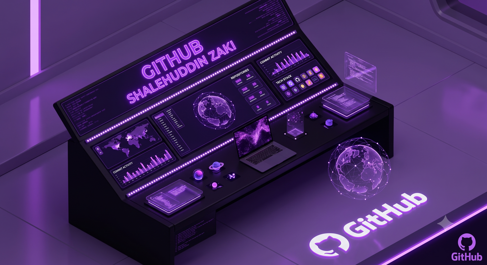

  

<h1 align="center">Hi, I'm Shalahuddin Zaki! 👋</h1>

  <em>Physics Graduate | Data Science & Machine Learning Enthusiast | AI Engineer</em>

  
  

---

### 👨‍💻 About Me
A physics graduate and data science enthusiast with a solid analytical foundation. I bridge the gap between complex physical systems and data-driven decision-making.

*   🔭 Currently refining my skills in **Data Science & Machine Learning** at **Dibimbing.id**.
*   💼 Experienced in **AI Development** (Intern at Orbit Future Academy) and **Material Science Research** (UKM, Malaysia).
*   ⚡ I excel at transforming metrics and raw data into actionable insights.

---

### 🛠 Tech Stack

---

### 🚀 Featured AI Projects

#### 1. Smart Split Bill (AI-Powered Expense Splitting)
*An intelligent solution to streamline collective transactions and automate receipt extraction.*
*   **The Problem:** Manual data entry from receipts is slow, prone to human error, and creates "social friction" in group payments.
*   **The Solution:** An automated system using **Gemini 1.5 Flash** for high-precision OCR to extract items, quantities, and prices from receipts.
*   **Tech Stack:** Python (Pandas/NumPy), Gemini 1.5 Flash, Streamlit.
*   **Key Results:** Real-time extraction with "Human-in-the-Loop" validation and automated tax/service charge detection.

#### 2. Intelligent Customer Assistant (RAG-based QnA)
*An automated knowledge base system for the agro-industry.*
*   **The Problem:** High volume of repetitive customer queries and slow response times (SLA).
*   **The Solution:** Built a production-ready **RAG (Retrieval-Augmented Generation)** architecture to automate internal SOPs.
*   **Innovation:** Developed native SQL-based **Cosine Similarity** calculation, removing dependency on unstable third-party extensions.

---

### 📈 GitHub Stats

  
  

### 📈 Get in Touch
*   **Gmail:** [shalehuddinzaki84@gmail.com](mailto:shalehuddinzaki84@gmail.com)
*   **Full Portfolio:** [https://bit.ly/MyPortofolio_project](https://bit.ly/MyPortofolio_project)
*   **LinkedIn:** [linkedin.com/in/shalehuddin-zaki](https://www.linkedin.com/in/shalehuddin-zaki)
